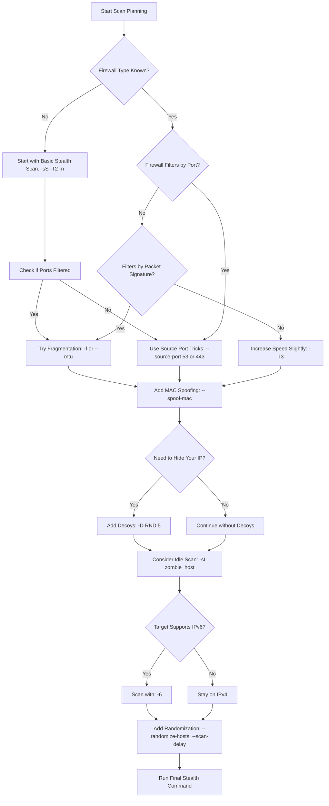

# Nmap Firewall Evasion – Layered Stealth Scanning Flow

```mermaid
flowchart TD

    A[Start Scan Planning] --> B{Firewall Type Known?}

    B -- No --> C[Start with Basic Stealth Scan: -sS -T2 -n]
    C --> D[Check if Ports Filtered]
    D -- Yes --> E[Try Fragmentation: -f or --mtu]
    D -- No --> F[Use Source Port Tricks: --source-port 53 or 443]

    B -- Yes --> G{Firewall Filters by Port?}
    G -- Yes --> F
    G -- No --> H{Filters by Packet Signature?}
    H -- Yes --> E
    H -- No --> I[Increase Speed Slightly: -T3]

    E --> J[Add MAC Spoofing: --spoof-mac]
    F --> J
    I --> J

    J --> K{Need to Hide Your IP?}
    K -- Yes --> L[Add Decoys: -D RND:5]
    K -- No --> M[Continue without Decoys]

    L --> N[Consider Idle Scan: -sI zombie_host]
    M --> N

    N --> O{Target Supports IPv6?}
    O -- Yes --> P[Scan with: -6]
    O -- No --> Q[Stay on IPv4]

    P --> R[Add Randomization: --randomize-hosts, --scan-delay]
    Q --> R

    R --> S[Run Final Stealth Command]
```
